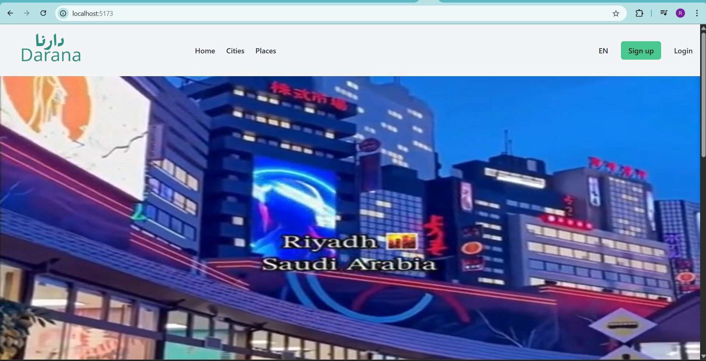
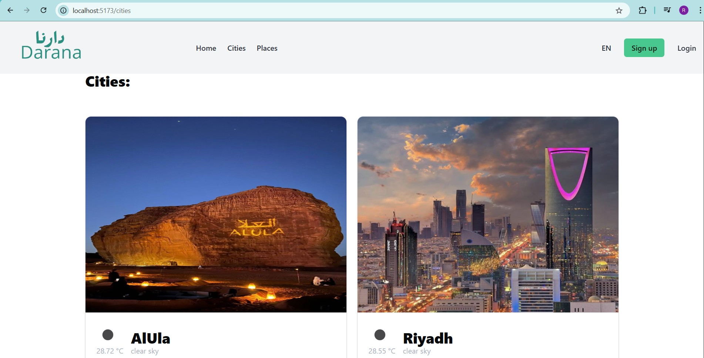
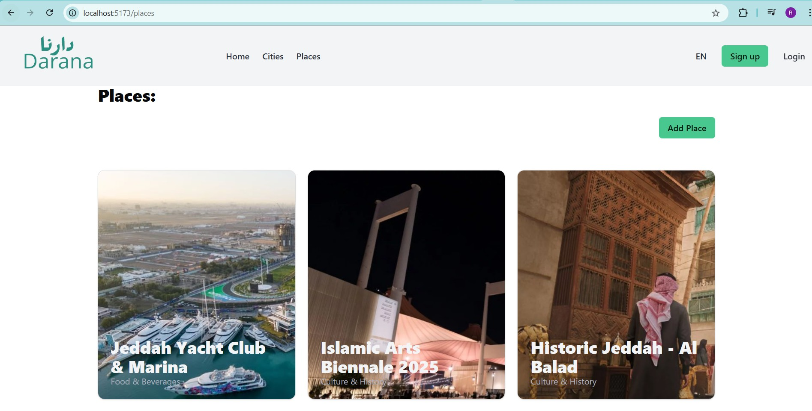

# Darana Website (دارنا) 
Darana (meaning "Our Home" in Arabic) is a website dedicated to showcasing the beauty, culture, and hidden gems of Saudi Arabia.
Through Darana, visitors can explore cities, discover historic sites, entertainment spots, cafes, and restaurants across the Kingdom.
The name reflects a deep connection to the homeland — Saudi Arabia as a shared "home" full of treasures to experience.

## Repository Description

This repository contains the frontend codebase of the application, built using React.js. The project is structured to separate concerns clearly for better scalability and maintainability.

### Folder Structure

- **`pages/`**  
  Contains all the main pages of the website. Each file or folder in this directory represents a route or view in the application.

- **`components/`**  
  Reusable UI components used across different pages (e.g., buttons, forms, modals, etc.).

- **`lib/api.js`**  
  Contains API utility functions including:
  - Authorized HTTP request handler
  - Token management (setToken, refreshToken, etc.)
  - Centralized API call logic

- **`App.jsx`**  
  Main application component that defines all client-side routes using React Router.

## Tech Stack
- **JavaScript** – Main programming language
- **React.js** – Frontend library for building the user interface
- **React Router** – Handles client-side routing
- **Axios** – For making HTTP requests to APIs
- **React Toastify** – Provides toast notifications
- **Bulma CSS** – Modern CSS framework for styling
- **Cloudinary** – use to uplaod images to cloud.

## Backend Repository
You can find the backend code here: [Backend Repository Link](https://git.generalassemb.ly/razanalshaikh/django-darana-backend.git)

## Installation Instructions
### Run Locally
1. Clone the repository:  
  ` git clone https://git.generalassemb.ly/razanalshaikh/react-darana-frontend.git `
2. Navigate to the project directory
    `cd react-darana-frontend`
3. Install dependencies: 
    `npm install`
4. Start the development Server
    `npm start`
5. Run the project
    `npm run dev`
    
## Screenshots
| Description | Screenshot                              |
| ----------- | --------------------------------------- |
| Homepage    |    |
| Cities Page  |            |
| Places Page   |  |

## IceBox Features
- Buttons for editing deleteing or adding only will be showed for admin or staff users.
- Create a page for adding or editing features.
- Add maps and location for places.
- Add reviews and rating for places.
- Save places for users side as want to go list.
- Cerate a catergory model to make places displayed by categories.
- Add more images and description for each place and each city.
- Add search buttons, where user searched for places and cities.

